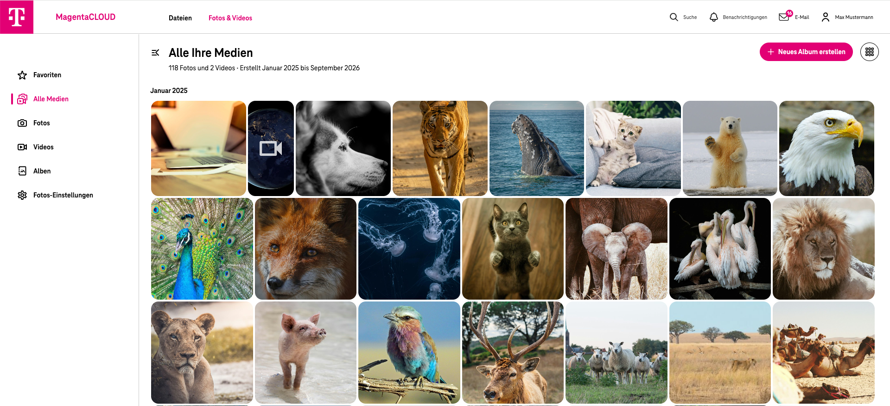

<!--
  - SPDX-FileCopyrightText: 2016-2024 Nextcloud GmbH and Nextcloud contributors
  - SPDX-License-Identifier: CC0-1.0
-->

# MagentaCLOUD Photos

**📸 Your memories in MagentaCLOUD**

MagentaCLOUD Photos provides a modern and convenient way to browse, organize, manage, and share your photos and videos stored in MagentaCLOUD.
This application is based on the open-source [Nextcloud Photos](https://github.com/nextcloud/photos) application and contains additional customizations for the MagentaCLOUD platform.

## ✨ Features

* **📸 Photo and video timeline:** Browse your photos and videos in a clear chronological view.
* **⭐ Favorites and tagging:** Mark your favorite photos and organize your media using tags.
* **▶️ Slideshows:** View your photos and videos as a slideshow.
* **🔗 Sharing:** Easily share albums with other users.
* **📁 Albums:** Create and manage albums from your existing photos and videos.
* **☁️ MagentaCLOUD integration:** Adapted user interface and functionality for the MagentaCLOUD environment.

## 🚀 MagentaCLOUD integration

This repository contains the MagentaCLOUD customized version of the Photos application.
The application is assembled and built as part of the MagentaCLOUD build and release process. Custom source changes are maintained separately from generated frontend assets wherever possible.
During the release build, the required dependencies are installed and the production JavaScript and CSS assets are generated from the current source code.
The resulting application package is used for deployment within the MagentaCLOUD platform.

## 📱 Mobile Photos

Photos and videos uploaded to MagentaCLOUD from supported mobile applications are available in the Photos interface.
Depending on the client configuration, photos and videos can also be uploaded automatically from mobile devices.

## 🔧 Upstream project

MagentaCLOUD Photos is based on:

[Nextcloud Photos](https://github.com/nextcloud/photos)

Upstream development, bug fixes, security fixes, and improvements are regularly integrated into the MagentaCLOUD version where applicable.
Additional MagentaCLOUD-specific functionality and user interface customizations are maintained separately to keep the differences to the upstream project as small and maintainable as possible.

## 🏗 Development setup

This application requires the [Nextcloud Viewer app](https://github.com/nextcloud/viewer) to be installed and enabled.

For local development:
1. ☁️ Clone the repository into the `custom_apps` or `apps` directory of your MagentaCLOUD development environment.
2. 👩‍💻 Install the required dependencies:
   npm ci
3. 🏗 Build the frontend assets:
   npm run build
4. ✅ Enable the app through the app management of your MagentaCLOUD.
5. 💻 Fix supported linting issues with:
   npm run lint:fix

Depending on the upstream version, additional development commands may be available through the project's package.json or Makefile.

## 📦 MagentaCLOUD release build

The MagentaCLOUD release workflow performs the relevant build steps automatically.

Among other things, it:
- installs PHP dependencies where required,
- installs the Node.js dependencies using npm ci,
- builds the production frontend assets using npm run build,
- removes development-only files and dependencies,
- packages the resulting application,
- and attaches the generated application archive to the corresponding release.

Generated JavaScript and CSS assets therefore do not necessarily have to differ from upstream in the customization branch itself. They are rebuilt from the customized sources during the release process.

## 🧪 Tests
The application uses the test infrastructure provided by the upstream Photos project.
Depending on the affected functionality, changes should be covered by the appropriate frontend, backend, or end-to-end tests.
Documentation for the Playwright end-to-end tests can be found here:
[Playwright end-to-end tests](./tests/playwright/README.md)

## 📄 Licensing and upstream attribution
This project contains software originally developed by Nextcloud GmbH and Nextcloud contributors.
MagentaCLOUD-specific modifications are maintained on top of the upstream project while preserving the applicable open-source licenses and attribution requirements.
